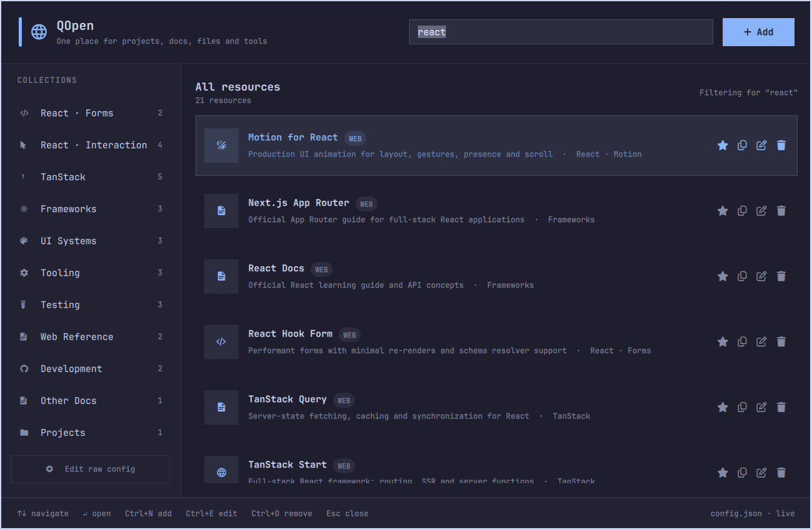

# QOpen for Omarchy（中文文档）

QOpen 是运行在 [Omarchy](https://omarchy.org/) 上的个人资源启动器。它把项目、文件、文档、Web 工具、终端应用、命令和 SSH 目标集中到一个支持搜索、键盘优先的界面中。

不同于应用启动器，QOpen 的目录由用户主动维护。新目录会提供少量通用示例，之后每个资源都可以由你保留、编辑、重新分组或删除。

> English summary: QOpen is a curated personal resource launcher for Omarchy. It brings projects, files, documentation, web tools, TUI applications, commands and SSH destinations into one searchable interface with grouping, favorites and native editing.

当前版本：**2.5.1**

**文档：** [English](README.md) · [开发记录](DEVELOPMENT.md)

## 功能亮点

- 使用实时主题 token 的原生 Omarchy Shell 与 Quickshell 界面。
- 可按名称、描述、稳定 id、类型、分组、目标和命令搜索。
- 集合显示资源数量、推荐顺序，并提供独立收藏视图。
- 首次启动提供覆盖常见资源类型的小型实用示例目录。
- 支持六种资源类型：web、project、file、TUI、command 和 SSH。
- 单页新增/编辑表单，根据资源类型显示字段并进行行内校验。
- 内置文件和目录浏览器，不使用 GTK/GVFS 文件对话框。
- 路径字段支持常规键盘粘贴，并提供明确的剪贴板按钮。
- 在适合时自动推导名称、id、默认分组和图标。
- 资源行内支持收藏、复制目标、编辑和确认后删除。
- JSON 写入锚定目录描述符，并使用目录锁、原子替换和上一个可用版本备份。
- 后端响应在进入 QML 前受字节上限和真实进程截止时间保护。
- 支持经过校验的备份恢复，以及显式的私有权限修复命令。
- 编辑带空格或引号的命令参数时保持无损往返。
- 可选状态栏组件：左键打开全部资源，右键打开收藏。
- 独立 CLI 支持启动、检查、CRUD 和诊断。

## 为什么需要 QOpen

Omarchy 本身已经很擅长启动已安装的桌面应用和 Shell 命令。QOpen 解决的是应用索引无法清晰表达的那一层资源：

- 每天都会进入的项目目录；
- 需要使用终端编辑器打开的配置文件；
- 经过筛选、值得长期保留的框架或库文档；
- 具有清晰显示名称的 TUI；
- 安全、明确的命令调用；
- 与同一环境中的其他资源放在一起的 SSH 目标。

目录始终保持小巧、可移植且易于理解。QOpen 不会扫描整个 home 目录。它只会在目录不存在时创建首次示例，绝不会向已有目录插入默认资源。

## 与 Omarchy Menu 的关系

QOpen 是系统自带 Omarchy Menu 的补充，而不是替代品。两个界面有明确不同的职责边界：

| 方面 | Omarchy Menu | QOpen |
| --- | --- | --- |
| 主要职责 | 系统控制和应用管理 | 访问经过筛选的个人资源 |
| 典型内容 | Apps、Setup、Install、Remove、Update、Style 和 System 操作 | 项目、文件、精选文档、Web 工具、TUI 命令和 SSH 目标 |
| 数据来源 | Omarchy 默认项、应用 provider 和菜单扩展 | `~/.config/qopen/config.json` |
| 组织方式 | 系统定义的菜单和路由 | 用户定义的分组、描述和收藏 |
| 推荐入口 | 系统快捷键或 Omarchy 状态栏按钮 | `Super+Alt+O`、可选状态栏按钮或 Omarchy Menu 子菜单 |

该集成不会覆盖系统标识符。Omarchy Menu 使用插件 id `omarchy.menu` 和 Layer namespace `omarchy-menu`；QOpen 使用 `qopen.launcher` 和 `qopen-launcher`。QOpen 的菜单扩展 id 统一使用 `custom-qopen.*` 命名空间。在经过测试的 Omarchy 4.0.1 环境中，推荐的 QOpen 快捷键与系统菜单快捷键不冲突，但安装前仍应检查本机快捷键配置。

应用发现、软件包安装、系统更新、外观设置和电源操作等系统级功能应继续放在 Omarchy Menu；手动选择的项目、文件、参考资料和环境目标应放在 QOpen。把 Apps、Install、Update 或 System 完整复制到 QOpen 会造成不必要的功能重复。

Omarchy Menu 中的 QOpen 子菜单只是可选的桥接入口，QOpen 状态栏组件同样可选。两个菜单都是使用独占键盘焦点的全屏 Overlay。通过 Omarchy Menu 操作启动 QOpen 是安全的，因为系统菜单会在执行操作前关闭。QOpen 每次打开时也会请求 Omarchy Shell 隐藏 `omarchy.menu`，因此在系统菜单可见时调用独立快捷键，不会留下两个同时挂载的独占焦点 Overlay。

## 环境要求

- 支持当前 Omarchy Shell 插件命令的 Omarchy。
- Omarchy 提供的 Quickshell。
- Python 3.10 或更高版本。
- 用于显示内置图标的 Nerd Font。
- `wl-clipboard`（提供 `wl-paste` 和 `wl-copy`），用于剪贴板操作。

QOpen 会在可用时使用 Omarchy 的启动 helper，并可通过以下命令检查完整的本地环境：

```bash
~/.config/omarchy/plugins/qopen.launcher/bin/qopen --doctor
```

2.5.1 发布版本在 Omarchy 4.0.1、Quickshell 0.3.1 和 Qt 6.11.2 上完成开发与验证。这些是已测试版本，并非严格版本锁定。

## 安装

直接从 GitHub 安装：

```bash
omarchy plugin add https://github.com/CoderLambert/qopen-omarchy-plugin.git --enable
```

启用前请先检查仓库源码：Omarchy Shell 插件运行在长期存在的 Shell 进程内，并不是沙箱程序。

检查源码后，可以进行非交互安装：

```bash
omarchy plugin add https://github.com/CoderLambert/qopen-omarchy-plugin.git --enable --yes
```

插件 id 是 `qopen.launcher`。如果安装时没有使用 `--enable`，可以稍后启用可选状态栏组件：

```bash
omarchy plugin enable qopen.launcher --section left
```

### 将 QOpen 添加到 Omarchy 菜单

编辑 `~/.config/omarchy/extensions/omarchy-menu.jsonc`，将以下条目加入根对象：

```jsonc
"custom-qopen": {
  "icon": "󰖟",
  "label": "QOpen",
  "description": "Projects, documentation, files and tools",
  "aliases": ["qopen", "resources"]
},

"custom-qopen.open": {
  "icon": "󰍉",
  "label": "Open QOpen",
  "description": "Grouped personal resource launcher",
  "action": "omarchy-shell shell toggle qopen.launcher '{}'"
},

"custom-qopen.favorites": {
  "icon": "",
  "label": "Favorites",
  "description": "Frequently used personal resources",
  "action": "omarchy-shell shell toggle qopen.launcher '{\"favorites\":true}'"
},

"custom-qopen.add": {
  "icon": "",
  "label": "Add Resource",
  "description": "Web, project, file, TUI, command or SSH",
  "action": "omarchy-shell shell toggle qopen.launcher '{\"action\":\"add\"}'"
}
```

保存后，Omarchy 菜单扩展文件会自动热加载。

### 推荐快捷键

在 `~/.config/hypr/bindings.lua` 中加入：

```lua
o.bind(
  "SUPER + ALT + O",
  "QOpen resource search",
  "omarchy-shell shell toggle qopen.launcher '{}'"
)
```

然后验证 Hyprland：

```bash
hyprctl reload
hyprctl configerrors
```

## 使用界面

通过快捷键、菜单、状态栏组件或 Shell 命令打开 QOpen：

```bash
omarchy-shell shell toggle qopen.launcher '{}'
```

其他常用路由：

```bash
# 收藏
omarchy-shell shell toggle qopen.launcher '{"favorites":true}'

# 指定集合
omarchy-shell shell toggle qopen.launcher '{"group":"projects"}'

# 打开新增表单
omarchy-shell shell toggle qopen.launcher '{"action":"add"}'

# 新增 project 并立即打开路径浏览器
omarchy-shell shell toggle qopen.launcher \
  '{"action":"add","type":"project","browse":true}'

# 打开指定资源的编辑器
omarchy-shell shell toggle qopen.launcher \
  '{"action":"edit","item":"react"}'
```

路由参数只决定初始界面状态，不会绕过编辑器校验，也不会直接写入目录。

### 使用截图



示例展示了 `react` 搜索：左侧是经过筛选的集合，右侧是适合键盘操作的资源和操作按钮。截图只保留 QOpen 面板，不包含周围桌面内容。

### 搜索与集合

直接输入即可在当前集合中搜索。集合对应资源的 `group` 字段，QOpen 会显示每个集合的实时资源数量。常见分组包括 `projects`、`frameworks`、`ui`、`testing`、`tools` 和 `docs`。

### 新增或编辑资源

1. 按 `Ctrl+N`，或点击 `+ Add`。
2. 选择资源类型。
3. 填写名称、id、分组和该类型对应的目标。
4. 对 file/project 资源，可以粘贴路径或使用内嵌浏览器。
5. 使用 Check 验证目标，然后点击 Save。

编辑时资源类型固定，避免类型专用字段被静默丢失。从路径浏览器选择文件或项目后，QOpen 可以根据路径推导名称和 id；保存前仍可修改这些值。

### 主界面快捷键

| 按键 | 操作 |
| --- | --- |
| 输入或粘贴 | 搜索当前集合 |
| `Up` / `Down` | 移动资源光标 |
| `Enter` | 打开选中的资源 |
| `Escape` | 依次清除搜索、关闭编辑器、关闭 QOpen |
| `Ctrl+N` | 新增资源 |
| `Ctrl+E` | 编辑选中资源 |
| `Ctrl+D` | 确认后删除选中资源 |
| `Ctrl+R` | 重新加载目录 |
| `Ctrl+Enter` | 编辑时保存 |

### 安全路径浏览器快捷键

| 按键 | 操作 |
| --- | --- |
| `Up` / `Down` | 选择条目 |
| `Enter` | 打开目录或选择文件 |
| `Alt+Up` | 打开上级目录 |
| `Ctrl+L` | 聚焦路径字段 |
| `Ctrl+H` | 显示或隐藏隐藏项 |
| `Escape` | 返回资源表单 |

Project 模式只列出目录，并通过底部按钮选择当前目录。File 模式同时列出目录和普通文件；双击文件会立即选择它。

## 资源类型

| 类型 | 必填值 | 打开行为 |
| --- | --- | --- |
| `web` | HTTP(S) 目标 | 使用 Omarchy Web App 或默认浏览器 |
| `project` | 目录路径 | 在该目录打开终端 |
| `file` | 文件路径 | 使用配置的终端编辑器打开 |
| `tui` | 参数数组 | 通过 Omarchy TUI helper 打开 |
| `command` | 参数数组 | 脱离运行或在终端中运行 |
| `ssh` | 主机或 `user@host` | 在终端中打开 `ssh` |

路径可以使用 `~`、环境变量或绝对路径。路径展开在 Python 后端中完成，不使用 Shell 插值。

有价值的目录会把相关资源放在一起，例如 React 富文本编辑器、动画库、图标系统、TanStack 工具、框架和测试参考。QOpen 为已知的前端分组提供推荐顺序，同时允许使用任意分组 id。

## 目录格式

默认目录保存在：

```text
~/.config/qopen/config.json
```

### 首次启动示例资源

如果目录尚不存在，第一次打开 QOpen 时会创建六个可正常编辑的通用资源：

| 资源 | 类型 | 用途 |
| --- | --- | --- |
| Omarchy | `web` | 打开 Omarchy 官方网站和文档 |
| GitHub | `web` | 打开仓库、Issue、Pull Request 和 Release |
| Home Directory | `project` | 在 `~` 中打开终端 |
| Omarchy Shell Config | `file` | 编辑 `~/.config/omarchy/shell.json` |
| btop | `tui` | 查看 CPU、内存、磁盘和进程 |
| Fastfetch | `command` | 显示简洁的系统信息摘要 |

已有目录绝不会被补写或修改。示例资源与普通资源完全相同，可以随时编辑或删除。QOpen 不创建 SSH 示例，因为不存在对所有用户都有效且有价值的通用主机。

示例：

```json
{
  "version": 1,
  "defaults": {
    "editor": "nvim",
    "webMode": "app"
  },
  "items": [
    {
      "id": "react",
      "name": "React Documentation",
      "type": "web",
      "group": "frameworks",
      "icon": "",
      "description": "Official React guides and API reference",
      "target": "https://react.dev/learn",
      "mode": "browser",
      "favorite": true
    },
    {
      "id": "my-app",
      "name": "My App",
      "type": "project",
      "group": "projects",
      "icon": "󰉋",
      "target": "~/Code/my-app"
    },
    {
      "id": "lazygit",
      "name": "Lazygit",
      "type": "tui",
      "group": "tools",
      "command": ["lazygit"]
    }
  ]
}
```

重要保证：

- id 只能包含小写字母、数字、`_` 或 `-`，并且必须唯一；
- 每次修改都会验证完整目录；
- 状态目录的每一级都以不跟随符号链接的方式打开；
- 配置和备份拒绝符号链接、硬链接及非普通文件；
- 写入锁定可信状态目录描述符，并使用同目录原子替换；
- 上一个目录版本会保留为 `config.json.bak`；
- 新建的默认状态目录使用 `0700`，新建或重写的状态文件使用 `0600`；已有状态
  只有在组用户和其他用户不可写时才会被接受，而 `--doctor` 会报告更宽松的私有
  权限，`fix-permissions` 可将默认状态目录和状态文件修复为 `0700`/`0600`；
- 目录读取、API 响应、helper 输出和目录扫描都有明确上限；
- QML 不会直接打开或写入目录，后端进程也具有真实截止时间；
- 个人资源数据不会自动同步到这个 GitHub 仓库。

可以设置 `QOPEN_CONFIG`，让 CLI 使用另一份目录：

```bash
QOPEN_CONFIG=~/Documents/qopen-work/config.json \
  ~/.config/omarchy/plugins/qopen.launcher/bin/qopen --list
```

请使用由当前账户拥有、且组用户和其他用户不可写的专用目录。QOpen 会验证
自定义状态目录，但绝不会修改该目录本身的权限。

## 命令行界面

后端会随插件一起安装：

```bash
QOPEN=~/.config/omarchy/plugins/qopen.launcher/bin/qopen

$QOPEN                         # 交互式资源选择器
$QOPEN --groups                # 按集合浏览
$QOPEN --favorites             # 浏览收藏
$QOPEN --list                  # 输出目录条目
$QOPEN <id>                    # 打开一个资源
$QOPEN add                     # 引导式新增
$QOPEN edit [id]               # 引导式编辑
$QOPEN remove [id]             # 确认后删除
$QOPEN favorite <id> toggle    # 切换收藏状态
$QOPEN recover                 # 校验并恢复 config.json.bak
$QOPEN fix-permissions         # 保护默认状态目录和状态文件
$QOPEN --doctor                # 验证依赖和全部条目
$QOPEN --version
```

非交互示例：

```bash
$QOPEN add project \
  --id qopen \
  --name "QOpen Plugin" \
  --group projects \
  --target ~/Code/qopen-omarchy-plugin \
  --favorite
```

`api` 子命令是 QML 使用的机器接口。它们输出紧凑 JSON，目前不应被视为长期稳定的公共集成 API。

## 架构与安全

```text
Omarchy 菜单 / 快捷键 / 状态栏组件
                 |
                 v
             QOpen.qml
                 |
       +---------+----------+
       |                    |
ResourceEditor.qml     PathPicker.qml
       |                    |
       +---------+----------+
                 | 有界 argv / 单行 JSON
                 v
         BoundedProcess.qml
                 |
                 v
              bin/qopen
                 |
   描述符锚定校验 + 目录 FD 锁
                 |
                 v
       ~/.config/qopen/config.json
```

QML 负责展示、焦点和交互。Python 负责目录枚举、规范化、校验、持久化和进程分发。

内嵌路径浏览器刻意避开 Qt `FileDialog`、GTK、GIO 和 GVFS。QOpen 运行在共享的 Omarchy Shell 进程中；不在该进程中接入原生文件对话框，可以避免选择器故障终止整个桌面 Shell。2.2 版本曾短暂使用原生对话框；2.3 在复现 Quickshell 崩溃后将其移除。证据和发布验证记录见 [DEVELOPMENT.md](DEVELOPMENT.md)。

用户主动选择的资源浏览会有意跟随符号链接，使普通 project/file 工作流与用户所选
文件系统路径保持一致。该浏览路径不会用于 QOpen 自身持久化：配置、备份、锁和替换
始终由经过独立校验的 `SecureStateStore` 信任边界负责。

命令始终以参数数组传递。QML 不会把资源值拼接成 Shell 命令。

QML 不使用 `FileView` 读取目录，也不通过 `StdioCollector` 保留完整进程流。
Python 生产端会在写出前校验并限制每个 API 响应；QML 随后只执行第二层协议大小检查。
有界 helper 运行在各自独立的进程组中，并通过 TERM 到 KILL 的升级机制落实真实截止
时间。配置、备份和恢复在完整生命周期内始终锚定到同一个可信目录描述符。

`$QOPEN --edit` 原始编辑入口已主动禁用，因为外部编辑器无法参与 QOpen 的锁、
校验、备份和原子替换协议。请改用原生编辑界面或 `$QOPEN edit [id]`。

## 更新和卸载

更新通过 Git 安装的插件：

```bash
omarchy plugin update qopen.launcher --yes
```

卸载插件：

```bash
omarchy plugin remove qopen.launcher --yes
```

卸载不会删除 `~/.config/qopen/config.json`，因此重新安装后仍可继续使用个人目录。

## 故障排查

### QOpen 不显示

```bash
omarchy plugin validate ~/.config/omarchy/plugins/qopen.launcher
omarchy-shell shell rescanPlugins
omarchy restart shell
```

### 资源无法打开

运行 doctor 并检查失败的资源：

```bash
~/.config/omarchy/plugins/qopen.launcher/bin/qopen --doctor
```

对于 file 和 project，确认展开后的路径存在。对于 TUI 和 command，确认第一个可执行文件可在 `PATH` 中找到。

### 目录无效

QOpen 会拒绝部分或格式错误的写入。检查：

```text
~/.config/qopen/config.json
~/.config/qopen/config.json.bak
```

备份是上一次成功修改前的目录状态。只能在校验通过后恢复：

```bash
~/.config/omarchy/plugins/qopen.launcher/bin/qopen recover
```

替换目录前，QOpen 会把当前无效文件保存为私有、带时间戳的
`config.json.invalid-*` 快照。如果 `--doctor` 报告状态文件可被同组或其他用户读取，
请显式修复权限：

```bash
~/.config/omarchy/plugins/qopen.launcher/bin/qopen fix-permissions
```

### 开发热重载问题

Omarchy 通常会热重载 `~/.config/omarchy/plugins` 下的文件。多文件修改时，在复制完全部文件后重启一次共享 Shell：

```bash
omarchy restart shell
```

这样可以避免文件处于中间状态时反复重建插件图。

## 开发

架构决策、发布历史、2.3 原生文件对话框事故、验证流程和维护工作流见 [DEVELOPMENT.md](DEVELOPMENT.md)。用户可见变更记录在 [CHANGELOG.md](CHANGELOG.md)。

运行可移植后端测试：

```bash
python -m unittest discover -s tests -v
```

## 许可证

[MIT](LICENSE) © 2026 CoderLambert